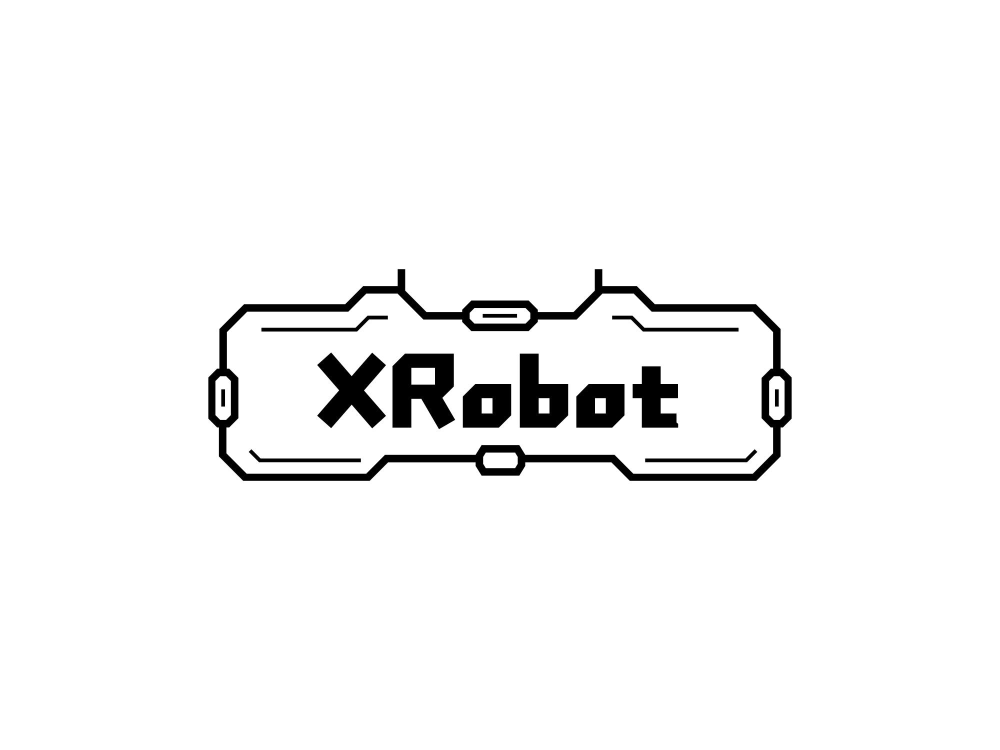

# [ATOM-IMU Module based on XRobot](https://www.bilibili.com/video/BV1iespeLE5S/?share_source=copy_web&vd_source=941b1c3432c2b11a6c408c836c9e2887)


## Parameter

* Output Rate: 1-1000Hz
* Support Voltage: 5V/24V
* Port: USB/UART/CANFD
* Support Data: ACCL/GYRO/EULR/QUAT
* Uart Baudrate: 460800(Terminal)/1M(Data)
* CAN Baudrate: 1M/5M
* GYRO: FULL 2000DPS, Resolution 0.015DPS
* ACCL: FULL 24G, Resolution 0.0001G

## Connection

USB-CH342: `UART_DATA(1M) UART_TERMINAL(460800)`

UART 1.25 4P: `1:RX 2:TX 3:GND 4:+5V_IN`

CAN 1.25 2P:  `1:CANL CANH`

XT30: `24V_IN`

## Example

```shell
├── linux_uart_example      `UART Prase Example on Linux`
├── ros_imu_publisher       `IMU Publisher on ROS`
├── ros_imu_subscriber      `IMU Subscriber on ROS`
├── ros_rviz_example.rviz   `IMU Data Visualization on ROS`
└── stm32_can_example       `CAN/CANFD Prase Example on STM32`
```

### linux_uart_example

please use [wch official usb driver](https://github.com/WCHSoftGroup/ch343ser_linux) for stability.

```shell
# generate signature
sudo apt install mokutil
sudo apt install shim-signed
sudo update-secureboot-policy --new-key
openssl req -new -x509 -newkey rsa:2048 -keyout MOK.priv -outform DER -out MOK.der -nodes -days 36500 -subj "/CN=Descriptive name/"
sudo mokutil --import /var/lib/shim-signed/mok/MOK.der

# reboot and enroll MOK
reboot

# build driver
git clone https://github.com/WCHSoftGroup/ch343ser_linux
cd ch343ser_linux/driver
make

# sign driver
sudo /usr/src/linux-headers-$(uname -r)/scripts/sign-file sha256 /var/lib/shim-signed/mok/MOK.priv /var/lib/shim-signed/mok/MOK.der ch343.ko

# install driver
sudo make install

reboot
```

```shell
# build example
gcc main.c -o main
./main
```

### ROS

VERSION=`rolling`

#### ros_imu_publisher

```shell
colcon build
ros2 run imu_publisher node_imu
```

#### ros_imu_subscriber

```shell
colcon build
ros2 run imu_subscriber node_imu
```

#### ros_rviz_example

Open it in rviz2.

### stm32_can_example

```shell
make
```

---


