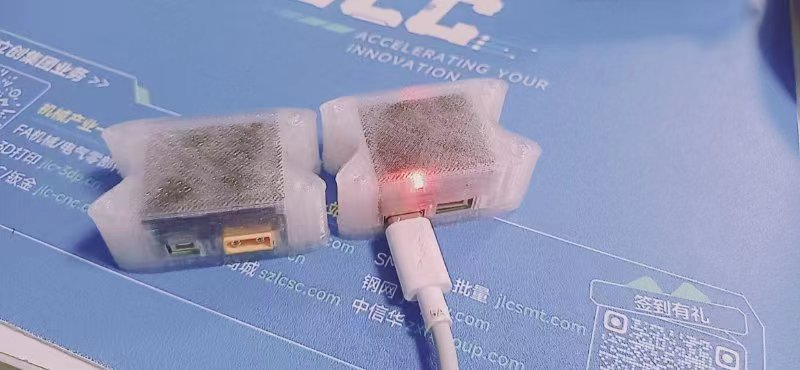
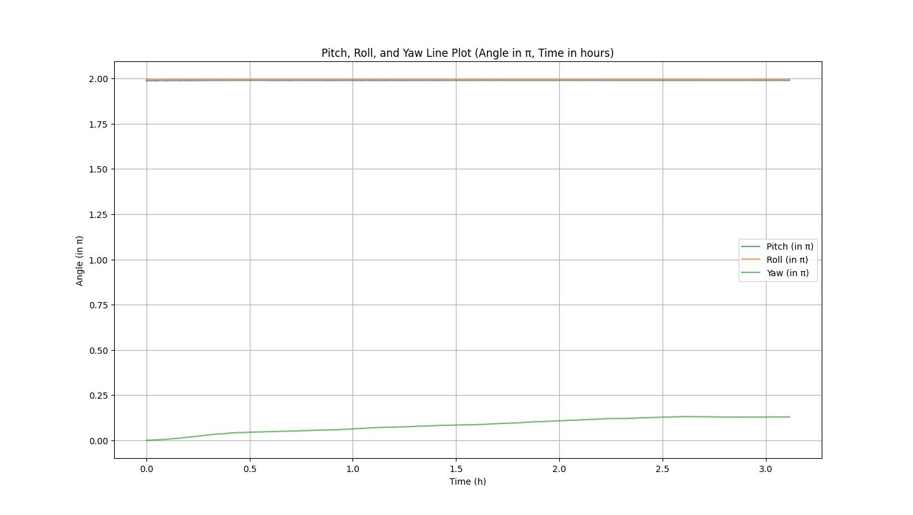
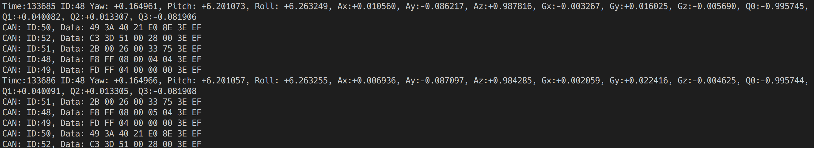
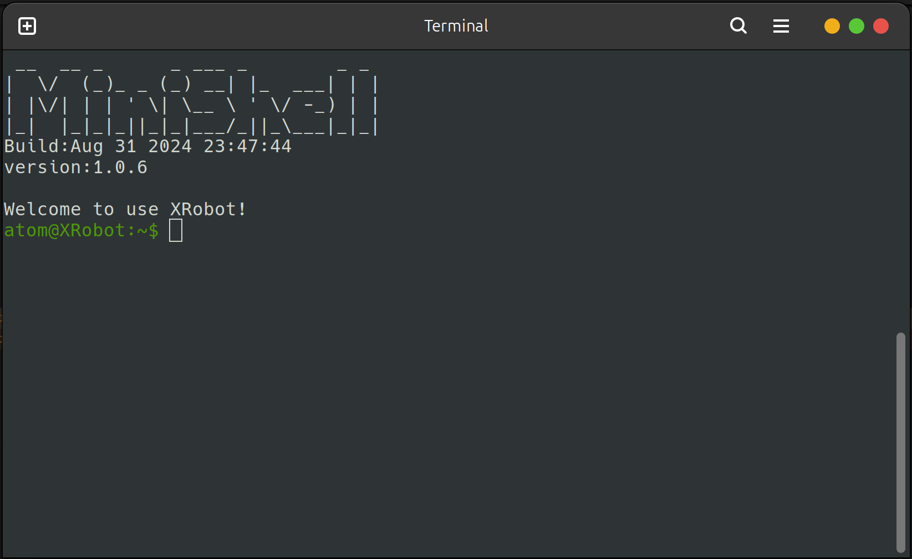
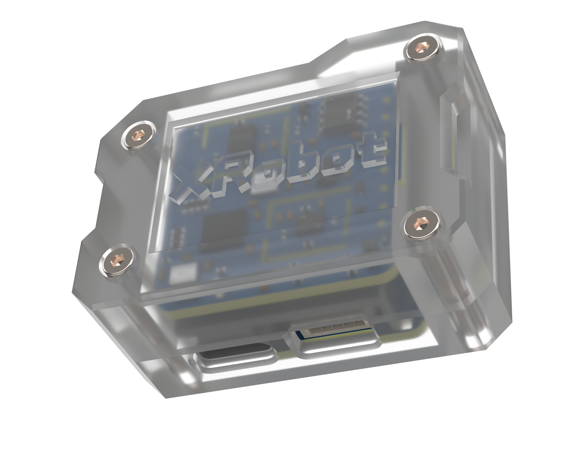
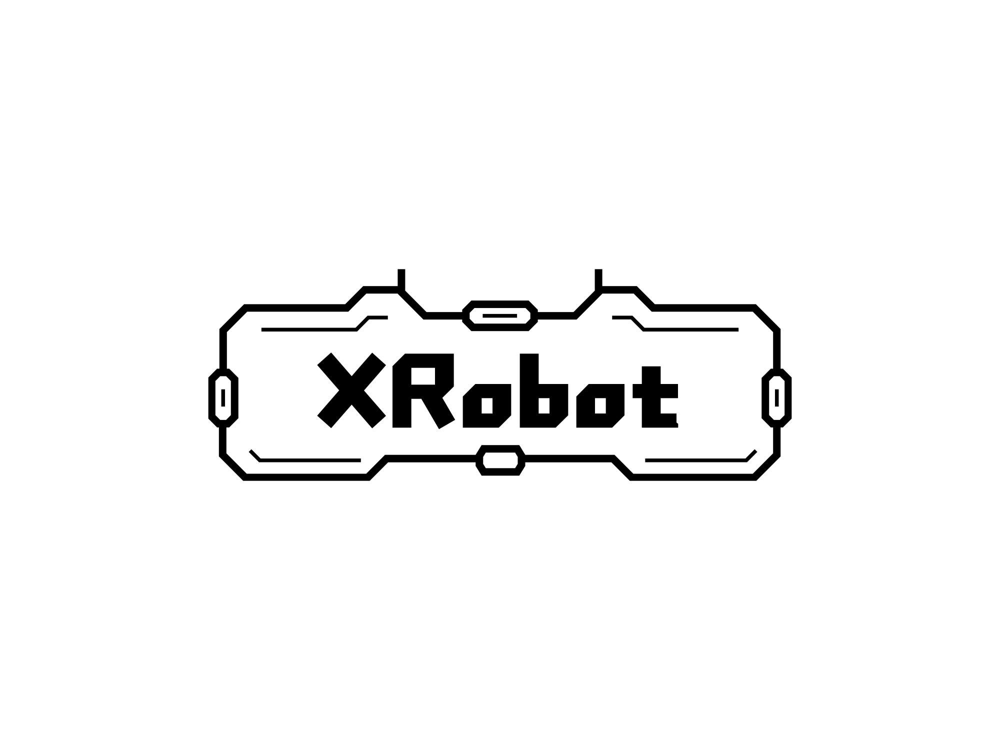

# ATOM-IMU Module based on XRobot



[English](./README.md) | [简体中文](./README.zh-CN.md)

## Parameter

* Output Rate: 1-1000Hz
* Support Voltage: 5V/24V
* Port: USB/UART/CANFD
* Support Data: ACCL/GYRO/EULR/QUAT
* Uart Baudrate: 460800(Terminal)/1M(Data)
* CAN Baudrate: 1M/5M
* GYRO: FULL 2000DPS, Resolution 0.015DPS
* ACCL: FULL 24G, Resolution 0.0001G

## Output Test



## Connection

USB-CH342: `UART_DATA(1M) UART_TERMINAL(460800)`

UART 1.25 4P: `1:RX 2:TX 3:GND 4:+5V_IN`

CAN 1.25 2P:  `1:CANL CANH`

XT30: `24V_IN`

## Example

```shell
├── linux_uart_example      `UART Prase Example on Linux`
├── ros_imu_publisher       `IMU Publisher on ROS`
├── ros_imu_subscriber      `IMU Subscriber on ROS`
├── ros_rviz_example.rviz   `IMU Data Visualization on ROS`
└── stm32_can_example       `CAN/CANFD Prase Example on STM32`
```

### linux_uart_example



please use [wch official usb driver](https://github.com/WCHSoftGroup/ch343ser_linux) for stability.

```shell
# generate signature
sudo apt install mokutil
sudo apt install shim-signed
sudo update-secureboot-policy --new-key
openssl req -new -x509 -newkey rsa:2048 -keyout MOK.priv -outform DER -out MOK.der -nodes -days 36500 -subj "/CN=Descriptive name/"
sudo mokutil --import /var/lib/shim-signed/mok/MOK.der

# reboot and enroll MOK
reboot

# build driver
git clone https://github.com/WCHSoftGroup/ch343ser_linux
cd ch343ser_linux/driver
make

# sign driver
sudo /usr/src/linux-headers-$(uname -r)/scripts/sign-file sha256 /var/lib/shim-signed/mok/MOK.priv /var/lib/shim-signed/mok/MOK.der ch343.ko

# install driver
sudo make install

reboot
```

```shell
# build example
gcc main.c -o main
./main
```

### ROS

VERSION=`rolling`

#### ros_imu_publisher

```shell
colcon build
ros2 run imu_publisher node_imu
```

#### ros_imu_subscriber

```shell
colcon build
ros2 run imu_subscriber node_imu
```

#### ros_rviz_example

Open it in rviz2.

### stm32_can_example

```shell
make
```

## Terminal

```shell
linux@XRobot:~$ ls /dev/ttyCH*
/dev/ttyCH343USB0  /dev/ttyCH343USB1

linux@XRobot:~$ picocom /dev/ttyCH343USB0 -b 460800
 __  __ _      _ ___ _        _ _ 
|  \/  (_)_ _ (_) __| |_  ___| | |
| |\/| | | ' \| \__ \ ' \/ -_) | |
|_|  |_|_|_||_|_|___/_||_\___|_|_|
Build:Aug 31 2024 23:47:44
version:1.0.6

Welcome to use XRobot!
atom@XRobot:~$ 
```



### set_imu

```shell
atom@XRobot:~$ set_imu
# Set mode: CAN / CANFD
can mode
# Set data type: Acceleration, Gyroscope, Quaternion, Euler angles
data:accl,gyro,quat,eulr,
# Enable UART output
uart output enabled.
# CAN_BRIDGE mode (Forward CAN data received via UART; enabling this mode forces the data UART baud rate to 2Mbps)
can bridge mode enabled.
# Set feedback delay (unit: milliseconds, range: 1-1000)
feedback delay:1
# Set CAN ID
id:48

Usage:
	set_delay  [time]  Set transmission delay in ms
	set_can_id [id]    Set CAN ID
	enable/disable     [accl/gyro/quat/eulr/canfd/can/uart/can_bridge]
	set_uart_baud      [0:9600 1:100000 2:115200 3:460800 4:921600 5:1000000 6:2000000]
	set_uart_parity    [0:None, 1:Odd, 2:Even]
```

### calibration

The entire process takes about 20 minutes

```shell
#Align the X-axis with the direction of gravity
atom@XRobot:~$ bmi088 cali
...
#Align the X-axis with the opposite direction of gravity
atom@XRobot:~$ bmi088 cali
...
#Align the Y-axis with the direction of gravity
atom@XRobot:~$ bmi088 cali
...
#Align the Y-axis with the opposite direction of gravity
atom@XRobot:~$ bmi088 cali
...
#Align the Z-axis with the direction of gravity
atom@XRobot:~$ bmi088 cali
...
#Align the Z-axis with the opposite direction of gravity
atom@XRobot:~$ bmi088 cali
...

atom@XRobot:~$ bmi088 cal_cali

#Align the Z-axis with the direction of gravity
atom@XRobot:~$ icm42688 cali
...
```

A well-calibrated result for a single axis (data evenly distributed with a small standard deviation):

```shell
atom@XRobot:~$ bmi088 cali
Calibration started, please keep the gyroscope stable. 
A total of six orientations need to be calibrated, with five cycles for each orientation. Please be patient.
Cycle 0 results: gx:0.006655 gy:-0.001768 gz:-0.000242 ax:-0.995890 ay:-0.025403 az:0.017022
Cycle 1 results: gx:0.006607 gy:-0.001795 gz:-0.000210 ax:-0.995826 ay:-0.025389 az:0.017130
Cycle 2 results: gx:0.006648 gy:-0.001823 gz:-0.000215 ax:-0.995846 ay:-0.025392 az:0.017057
Cycle 3 results: gx:0.006646 gy:-0.001818 gz:-0.000261 ax:-0.995899 ay:-0.025318 az:0.017129
Cycle 4 results: gx:0.006620 gy:-0.001803 gz:-0.000195 ax:-0.995871 ay:-0.025370 az:0.017050
Calibration result: x:0.006635 y:-0.001801 z:-0.000225 accl:-0.995871
```

If the data exhibits an increasing/decreasing trend or significant fluctuations, recalibration is required.
Each axis can be calibrated multiple times, and the order is not fixed.

For the final calibration result, the standard is that each error value in the error matrix should be less than 0.0001 (a few slightly above 0.0001 are acceptable):

```shell
atom@XRobot:~$ bmi088 cal_cali
x:  0.000062  0.000040 -0.000053  0.006701
y:  0.000030  0.000051 -0.000048 -0.001750
z: -0.000028 -0.000026  0.000058 -0.000260
error:
-0.000004 -0.000021 +0.000007
+0.000079 +0.000039 -0.000050
-0.000106 -0.000033 +0.000062
-0.000026 -0.000000 +0.000010
+0.000062 +0.000021 -0.000091
+0.000016 +0.000004 +0.000024
All calibration steps have been completed.
```

### Measure zero offset

```shell
atom@XRobot:~$ /dev/AHRS test
请保持静止，开始检测零漂
请等待
零漂:-0.120239度/分钟
```

## **USB to CAN Mode**

```shell
atom@XRobot:~$ can
monitor [number: 1-32] [timeout] 监控指定数量的can包
atom@XRobot:~$ can monitor 5 100
CanId ID:00000030 DATA:fe ff 03 00 f6 03 a5 ef
CanId ID:00000031 DATA:fc ff 0d 00 00 00 a5 ef
CanId ID:00000032 DATA:be 3c b6 20 44 8d a5 ef
CanId ID:00000034 DATA:de 3d 60 00 38 00 a5 ef
CanId ID:00000033 DATA:32 00 32 00 77 75 a5 ef
CanId ID:00000030 DATA:fe ff 04 00 f7 03 a5 ef
CanId ID:00000031 DATA:fd ff 0d 00 00 00 a5 ef
CanId ID:00000032 DATA:be 3c b6 20 44 8d a5 ef
CanId ID:00000034 DATA:de 3d 60 00 37 00 a5 ef
CanId ID:00000033 DATA:32 00 32 00 77 75 a5 ef
```

### View data on VOFA+

Please add the following custom commands:

```shell
/dev/AHRS print_quat 1000000 1\r\n
```

## 3D Model

[Top Model](./3D/imu_top.step)

[Bottom Model](./3D/imu_bottom.step)



## Protocol

### UART

UART will receive two types of data: Data Frames (Data) and CAN Transparent Transmission Frames (DataCanToUart).

* Data Frame includes: Prefix, ID, Timestamp, Quaternion, Gyroscope, Acceleration, and CRC8 Checksum.
* CAN Transparent Transmission Frame includes: Prefix, ID, Data, and CRC8 Checksum.
The CAN Transparent Transmission Frame can be sent either from the controller to this module or from this module to the controller, enabling CAN interface extension.

```c++
typedef struct __attribute__((packed)) {
  float x;
  float y;
  float z;
} Vector3;

typedef struct __attribute__((packed)) {
  float q0;
  float q1;
  float q2;
  float q3;
} Quaternion;

typedef struct __attribute__((packed)) {
  float yaw;
  float pit;
  float rol;
} EulerAngles;

typedef struct __attribute__((packed)) {
  uint8_t prefix;
  uint8_t id;
  uint32_t time_ms;
  Quaternion quat;
  Vector3 gyro;
  Vector3 accl;
  EulerAngles eulr;
  uint8_t crc8;
} Data;

typedef struct __attribute__((packed)) {
  uint8_t prefix;
  uint32_t id;
  uint8_t data[8];
  uint8_t crc8;
} DataCanToUart;
```

### CAN

```c++
struct __attribute__((packed)) {
  uint32_t id;
  uint16_t data[4];
}can_pack;

switch (can_pack.id) {
      case IMU_ID:
        accl.x = (float)(can_pack.data[0]) / 32767.0f * 16.0f;
        accl.y = (float)(can_pack.data[1]) / 32767.0f * 16.0f;
        accl.z = (float)(can_pack.data[2]) / 32767.0f * 16.0f;
        break;
      case IMU_ID + 1:
        gyro.x = (float)(can_pack.data[0]) / 32767.0f * 34.90658502f;
        gyro.y = (float)(can_pack.data[1]) / 32767.0f * 34.90658502f;
        gyro.z = (float)(can_pack.data[2]) / 32767.0f * 34.90658502f;
        break;
      case IMU_ID + 3:
        eulr.pit = (float)(can_pack.data[0]) / 32767.0f * M_2PI;
        eulr.rol = (float)(can_pack.data[1]) / 32767.0f * M_2PI;
        eulr.yaw = (float)(can_pack.data[2]) / 32767.0f * M_2PI;
        break;
      case IMU_ID + 4:
        quat.q0 = (float)(can_pack.data[0]) / 32767.0f * 2.0f;
        quat.q1 = (float)(can_pack.data[1]) / 32767.0f * 2.0f;
        quat.q2 = (float)(can_pack.data[2]) / 32767.0f * 2.0f;
        quat.q3 = (float)(can_pack.data[3]) / 32767.0f * 2.0f;
        break;
      default:
        break;
      }
```

### CANFD

```c++
 //CANID = IMU_ID

typedef struct __attribute__((packed)) {
  uint32_t time;
  Quaternion quat_;
  Vector3 gyro_;
  Vector3 accl_;
  EulerAngles eulr_;
} Data;
```

## Update Firmware

<font color=red>⚠Important: Never erase the entire flash!!!</font>

1. Get the latest firmware

    See [Firmware](./firmware).

1. Enter the bootloader mode

    ```sh
    # Input in terminal
    power bl
    ```

1. Flash the firmware

    Use uart download tool to flash the firmware, such as `STM32CubeProgrammer` or `stm32flash`.
    Uart port: SERIAL-B(UART-DATA)

1. Reboot

    Restart the power supply.

## [Video](https://www.bilibili.com/video/BV1iespeLE5S/?share_source=copy_web&vd_source=941b1c3432c2b11a6c408c836c9e2887)

## [Buy Now](https://mall.bilibili.com/neul-next/index.html?page=mall-up_itemDetail&noTitleBar=1&itemsId=1106251092&from=items_share&msource=items_share)


