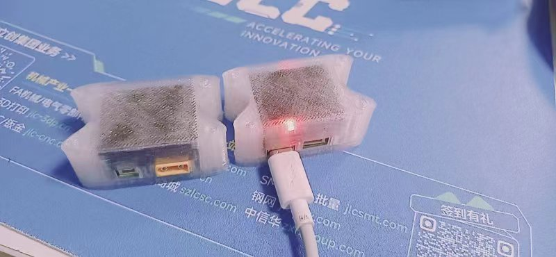

# ATOM-IMU Module based on XRobot



## Parameter

* Output Rate: 1-1000Hz
* Support Voltage: 5V/24V
* Port: USB/UART/CANFD
* Support Data: ACCL/GYRO/EULR/QUAT
* Uart Baudrate: 460800(Terminal)/1M(Data)
* CAN Baudrate: 1M/5M
* GYRO: FULL 2000DPS, Resolution 0.015DPS
* ACCL: FULL 24G, Resolution 0.0001G

## Connection

USB-CH342: `UART_DATA(1M) UART_TERMINAL(460800)`

UART 1.25 4P: `1:RX 2:TX 3:GND 4:+5V_IN`

CAN 1.25 2P:  `1:CANL CANH`

XT30: `24V_IN`

## Example

```shell
├── linux_uart_example      `UART Prase Example on Linux`
├── ros_imu_publisher       `IMU Publisher on ROS`
├── ros_imu_subscriber      `IMU Subscriber on ROS`
├── ros_rviz_example.rviz   `IMU Data Visualization on ROS`
└── stm32_can_example       `CAN/CANFD Prase Example on STM32`
```

### linux_uart_example

please use [wch official usb driver](https://github.com/WCHSoftGroup/ch343ser_linux) for stability.

```shell
# generate signature
sudo apt install mokutil
sudo apt install shim-signed
sudo update-secureboot-policy --new-key
openssl req -new -x509 -newkey rsa:2048 -keyout MOK.priv -outform DER -out MOK.der -nodes -days 36500 -subj "/CN=Descriptive name/"
sudo mokutil --import /var/lib/shim-signed/mok/MOK.der

# reboot and enroll MOK
reboot

# build driver
git clone https://github.com/WCHSoftGroup/ch343ser_linux
cd ch343ser_linux/driver
make

# sign driver
sudo /usr/src/linux-headers-$(uname -r)/scripts/sign-file sha256 /var/lib/shim-signed/mok/MOK.priv /var/lib/shim-signed/mok/MOK.der ch343.ko

# install driver
sudo make install

reboot
```

```shell
# build example
gcc main.c -o main
./main
```

### ROS

VERSION=`rolling`

#### ros_imu_publisher

```shell
colcon build
ros2 run imu_publisher node_imu
```

#### ros_imu_subscriber

```shell
colcon build
ros2 run imu_subscriber node_imu
```

#### ros_rviz_example

Open it in rviz2.

### stm32_can_example

```shell
make
```

## Terminal

```shell
linux@XRobot:~$ ls /dev/ttyCH*
/dev/ttyCH343USB0  /dev/ttyCH343USB1

linux@XRobot:~$ picocom /dev/ttyCH343USB0 -b 460800
 __  __ _      _ ___ _        _ _ 
|  \/  (_)_ _ (_) __| |_  ___| | |
| |\/| | | ' \| \__ \ ' \/ -_) | |
|_|  |_|_|_||_|_|___/_||_\___|_|_|
Build:Aug 31 2024 23:47:44
version:1.0.6

Welcome to use XRobot!
atom@XRobot:~$ 
```


### set_imu

```shell
atom@XRobot:~$ set_imu

# can/canfd
can mode
# accl/gyro/quat/eulr
data:accl,gyro,quat,eulr,
# 1-1000
feedback delay:2
# CAN ID
id:48

Usage:
 set_delay  [time]       设置发送延时ms
 set_can_id [id]         设置can id
 enable/disable     [accl/gyro/quat/eulr/canfd]
```

### calibration

The entire process takes about 20 minutes

```shell
#Align the X-axis with the direction of gravity
atom@XRobot:~$ bmi088 cali
...
#Align the X-axis with the opposite direction of gravity
atom@XRobot:~$ bmi088 cali
...
#Align the Y-axis with the direction of gravity
atom@XRobot:~$ bmi088 cali
...
#Align the Y-axis with the opposite direction of gravity
atom@XRobot:~$ bmi088 cali
...
#Align the Z-axis with the direction of gravity
atom@XRobot:~$ bmi088 cali
...
#Align the Z-axis with the opposite direction of gravity
atom@XRobot:~$ bmi088 cali
...

atom@XRobot:~$ bmi088 cal_cali

#Align the Z-axis with the direction of gravity
atom@XRobot:~$ icm42688 cali
...
```

### Measure zero offset

```shell
atom@XRobot:~$ /dev/AHRS test
请保持静止，开始检测零漂
请等待
零漂:-0.120239度/分钟
```

### View data on VOFA+

Add custom command on VOFA+

```shell
/dev/AHRS print_quat 1000000 1\r\n
```

## 3D Model

[Top Model](./3D/top.STEP)

[Bottom Model](./3D/bottom.STEP)


## Protocol

### UART

```c++
typedef struct __attribute__((packed)) {
  float x;
  float y;
  float z;
} Vector3;

typedef struct __attribute__((packed)) {
  float q0;
  float q1;
  float q2;
  float q3;
} Quaternion;

typedef struct __attribute__((packed)) {
  float yaw;
  float pit;
  float rol;
} EulerAngles;

typedef struct __attribute__((packed)) {
  uint8_t prefix;
  uint8_t id;
  uint32_t time_ms;
  Quaternion quat;
  Vector3 gyro;
  Vector3 accl;
  EulerAngles eulr;
  uint8_t crc8;
} Data;
```

### CAN

```c++
struct __attribute__((packed)) {
  uint32_t id;
  uint16_t data[4];
}can_pack;

switch (can_pack.id) {
      case IMU_ID:
        accl.x = (float)(can_pack.data[0]) / 32767.0f * 16.0f;
        accl.y = (float)(can_pack.data[1]) / 32767.0f * 16.0f;
        accl.z = (float)(can_pack.data[2]) / 32767.0f * 16.0f;
        break;
      case IMU_ID + 1:
        gyro.x = (float)(can_pack.data[0]) / 32767.0f * 34.90658502f;
        gyro.y = (float)(can_pack.data[1]) / 32767.0f * 34.90658502f;
        gyro.z = (float)(can_pack.data[2]) / 32767.0f * 34.90658502f;
        break;
      case IMU_ID + 3:
        eulr.pit = (float)(can_pack.data[0]) / 32767.0f * M_2PI;
        eulr.rol = (float)(can_pack.data[1]) / 32767.0f * M_2PI;
        eulr.yaw = (float)(can_pack.data[2]) / 32767.0f * M_2PI;
        break;
      case IMU_ID + 4:
        quat.q0 = (float)(can_pack.data[0]) / 32767.0f * 2.0f;
        quat.q1 = (float)(can_pack.data[1]) / 32767.0f * 2.0f;
        quat.q2 = (float)(can_pack.data[2]) / 32767.0f * 2.0f;
        quat.q3 = (float)(can_pack.data[3]) / 32767.0f * 2.0f;
        break;
      default:
        break;
      }
```

### CANFD

```c++
 //CANID = IMU_ID

typedef struct __attribute__((packed)) {
  uint32_t time;
  Quaternion quat_;
  Vector3 gyro_;
  Vector3 accl_;
  EulerAngles eulr_;
} Data;
```

## [Video](https://www.bilibili.com/video/BV1iespeLE5S/?share_source=copy_web&vd_source=941b1c3432c2b11a6c408c836c9e2887)

## [Buy Now](https://mall.bilibili.com/neul-next/index.html?page=mall-up_itemDetail&noTitleBar=1&itemsId=1106251092&from=items_share&msource=items_share)


